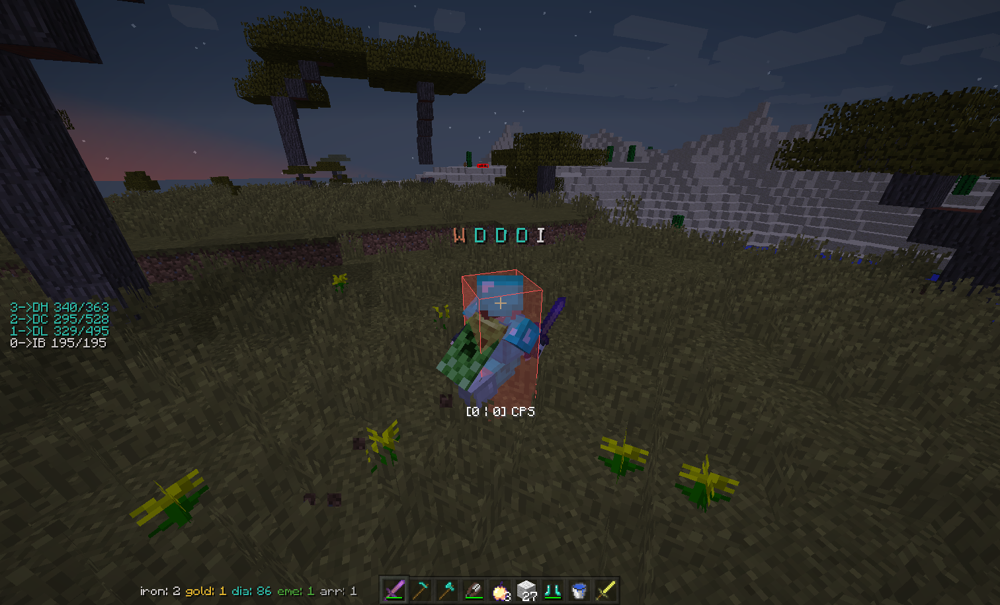

# Armor Bar

显示周围玩家的盔甲信息条（包括手持）



## Feature

- 可选 自己的是否显示
- 可选 隐身/蹲下时是否显示
- 可选 是否永远面向玩家
- 可选 是否渲染文本阴影
- 可选 是否根据盔甲材质渲染对应颜色的文本
- 可选 是否根据玩家所在队伍渲染对应颜色的文本
- 可选 文本横向/纵向显示
- 自定义文本 对齐模式/间距
- 渲染距离/偏移/尺寸可调整
- 在盔甲类型列表内，可选某种对象类型是否渲染
  ```text
  "holding", "helmet", "chestplate", "leggings", "boots"
  ```
  
## Command

### `/evarmorbar <option>`

- `toggle` — 切换开关
- `self` — 是否显示自己的
- `invis` — 隐身是否隐藏
- `sneak` — 蹲下是否隐藏
- `face` — HUD是否永远面向玩家
- `armor` — 是否根据盔甲材质渲染文本颜色
- `team` — 是否根据玩家队伍渲染文本颜色
- `shadow` — 是否渲染文本阴影
- `vertical` — 是否纵向显示文本
- `align` — 切换对齐方式
- `spacing <value>` — 文字渲染间距
- `distance <value>` — 最大渲染距离
- `scale <value>` — 渲染尺寸
- `xoffset <value>` / `yoffset <value>` / `zoffset <value>` — 渲染位置偏移
- `addtype <value>` / `rmtype <value>` — 添加/移除需检查的盔甲类型

## Configuration

### `armorbar`

- `enabled`, `showSelf`, `hideWhenInvisible`, `hideWhenSneaking`, `facePlayer`, `armorColor`, `teamColor`, `textShadow`, `vertical` — booleans
- `maxDistance`, `scale`, `xOffset`, `yOffset`, `zOffset` — floats
- `typeList` — String List
- `textAlgin`, `textSpacing` — ints