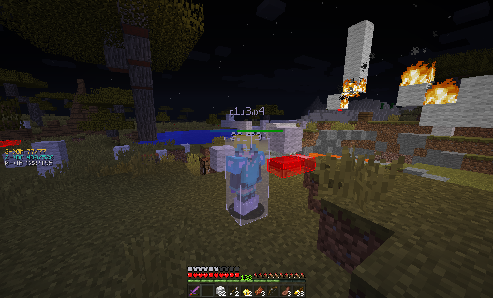

# Armor HUD

在屏幕显示当前玩家盔甲穿着状态

## Feature

- 可选 是否在打开 GUI 时隐藏
- 可选 是否渲染耐久值
- 自定义颜色/阴影/对齐模式/间距
- 可选 是否根据盔甲材质决定颜色
- 可选 是否纵向渲染
- 渲染尺寸/偏移 可调整

## Command

### `/evarmorhud <option>`

- `toggle` — 切换开关
- `gui` — 是否在打开 GUI 时隐藏
- `durability` — 是否渲染耐久值
- `color <value>` — 文本颜色 (16进制 ARGB 字符串)
- `shadow` — 是否渲染文本阴影
- `armor` — 是否根据盔甲材质决定颜色
- `vertical` — 是否纵向渲染
- `align` — 切换对齐方式
- `spacing <value>` — 文字渲染间距
- `scale <value>` — 渲染尺寸
- `xoffset <value>` / `yoffset <value>` — 渲染位置偏移

## Configuration

### `armorhud`

- `enabled`, `hideWhenGuiOpen`, `showDurability`, `shadow`, `armor`, `vertical` — booleans
- `scale`, `xoffset`, `yoffset` — floats
- `color` — String
- `textAlgin`, `textSpacing` — ints