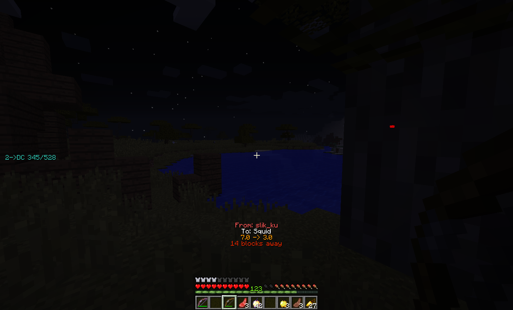

# Arrow HUD

在屏幕显示当前玩家相关的弓箭信息



## Feature

- 服务器支持依赖于 `Pattern` 匹配以下信息
  ```text
  ^(\\w+) is on ([0-9]*[.]?[0-9]+) HP!
  ```
- 可选 是否在打开 GUI 时隐藏
- 可选 是否显示射击者/受击者 名字
- 可选 是否显示 伤害量/剩余血量/射击距离
- 自定义颜色/阴影/对齐模式/间距
- 可选 是否根据玩家队伍决定渲染名字颜色
- 可选 是否纵向渲染
- 可选 是否一段时间后消失，消失时间可配置
- 渲染尺寸/偏移 可调整

## Command

### `/evarrowhud <option>`

- `toggle` — 切换开关
- `gui` — 是否在打开 GUI 时隐藏
- `from` — 是否显示射击者
- `target` — 是否显示受击者
- `damage` — 是否显示伤害量
- `remaining` — 是否显示剩余血量
- `distance` — 是否显示射击距离
- `color <value>` — 文本颜色 (16进制 ARGB 字符串)
- `team` — 是否根据队伍决定玩家名字颜色
- `shadow` — 是否渲染文本阴影
- `vertical` — 是否纵向渲染
- `fade` — 是否消失
- `align` — 切换对齐方式 
- `spacing <value>` — 文字渲染间距 
- `time <value>` — 消失时间 
- `scale <value>` — 渲染尺寸
- `xoffset <value>` / `yoffset <value>` — 渲染位置偏移

## Configuration

### `arrowhud`

- `enabled`, `hideWhenGuiOpen`, `showFrom`, `showTarget`, `showDamage`, `showRemaining`, `showDistance`, `teamColor`, `textShadow`, `vertical`, `fade` — booleans
- `scale`, `xoffset`, `yoffset` — floats
- `color` — String
- `textAlgin`, `textSpacing`, `fadeTime` — ints