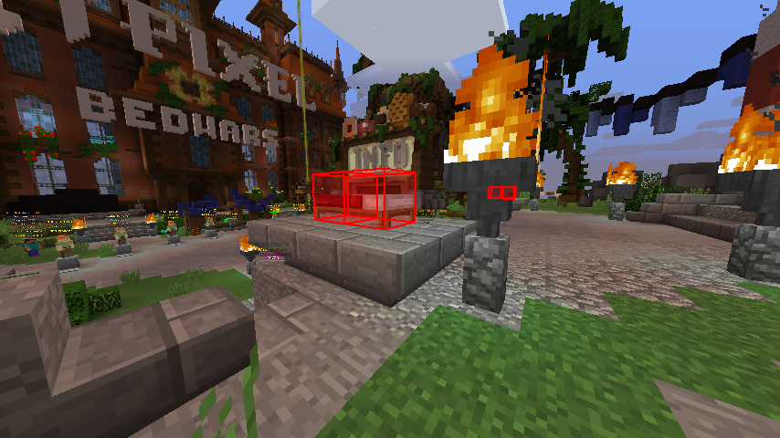

# Block Overlay

为指定方块渲染额外覆盖层

## Feature

- 可选 是否按真实尺寸渲染
- 可选 是否渲染边/面
- 边宽度 可调整
- 覆盖层扩展距离可调整 (设为 0 以上可防止渲染闪烁问题)
- 渲染距离/颜色 可调整 
- 自定义方块扫描频率
- 自定义每帧最大方块渲染数量

## Command

### `/evblockoverlay <option>`

- `toggle` — 切换开关
- `real` — 是否按真实尺寸渲染
- `edge` — 是否渲染方块边
- `face` — 是否渲染方块面
- `expand <value>` — 渲染扩展距离
- `distance <value>` — 渲染距离
- `width <value>` — 边宽度
- `edgecolor <value>` — 边颜色 (16进制 ARGB 字符串)
- `facecolor <value>` — 面颜色 (16进制 ARGB 字符串)
- `add <value>` / `remove <value>` — 添加/移除需渲染方块
- `interval <value>` — 渲染检测间隔毫秒
- `limit <value>` — 每帧最多渲染的方块数目

## Configuration

### `blockoverlay`

- `enabled`, `renderRealSize`, `renderEdges`, `renderFaces` — booleans
- `renderExpand`, `maxDistance`, `edgeWidth` — floats
- `edgeColor`, `faceColor` — Strings
- `blockList` — String List
- `scanInterval`, `limit` — ints