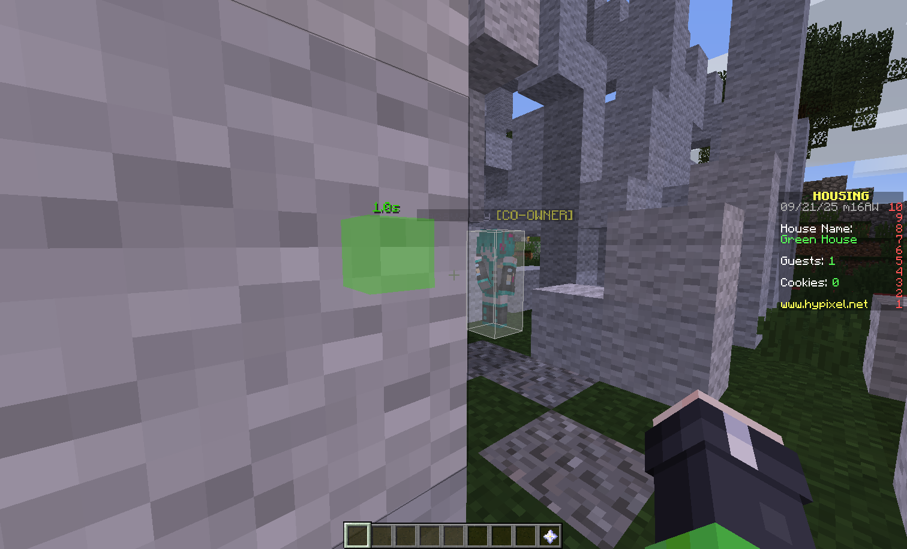

# Break Overlay

为玩家挖掘方块行为渲染额外覆盖层

## Feat

- 可选 是否显示 自身/他人 挖掘进度文本
- 文本是否永远面向玩家
- 文本构造可切换三种模式
  - 百分比 `0`
  - 剩余破坏时间 `1` 
  - 已挖掘时间 `2`
- 文本是否渲染阴影
- 可选 是否高亮 自身/他人 挖掘方块 
- 可选 是否按真实尺寸渲染方块
- 根据破坏进度，动态混合方块高亮颜色 **绿 → 红**
- 方块高亮 透明度/覆盖层扩展距离 可调整
- 渲染距离和文本渲染/尺寸/偏移 可调整
- 自定义方块扫描频率
- 自定义每帧最大方块渲染数量
- 自定义渲染检测的超时判定时间

## Command

### `/evbreakoverlay <option>`

- `toggle` — 切换开关
- `self` / `other` — 是否显示 自己/他人 的文本
- `face` — 文本是否永远面向玩家
- `mode` — 文本构造模式切换
- `shadow` — 是否渲染文本阴影
- `selfblock` / `otherblock` — 是否高亮 自己/他人 的挖掘方块
- `real` — 是否按真实尺寸渲染方块
- `alpha <value>` — 方块高亮透明度 (16进制 Alpha 字符串)
- `expand <value>` — 方块高亮渲染扩展距离
- `distance <value>` — 渲染距离
- `scale <value>` — 文本渲染尺寸
- `xoffset <value>` / `yoffset <value>` / `zoffset <value>` — 文本渲染偏移
- `interval <value>` — 渲染检测间隔毫秒
- `limit <value>` — 每帧最多渲染的信息数目
- `timeout <value>` — 超时判定时长毫秒

## Configuration

`breakoverlay`

- `enabled`, `showSelf`, `showOther`, `facePlayer`, `textShadow`, `showSelfBlock`, `showOtherBlock`, `renderRealSize` — booleans
- `renderExpand`, `maxDistance`, `scale`, `xOffset`, `yOffset`, `zOffset` — floats
- `blockAlpha` — String
- `mode`, `scanInterval`, `limit`, `timeout` — ints