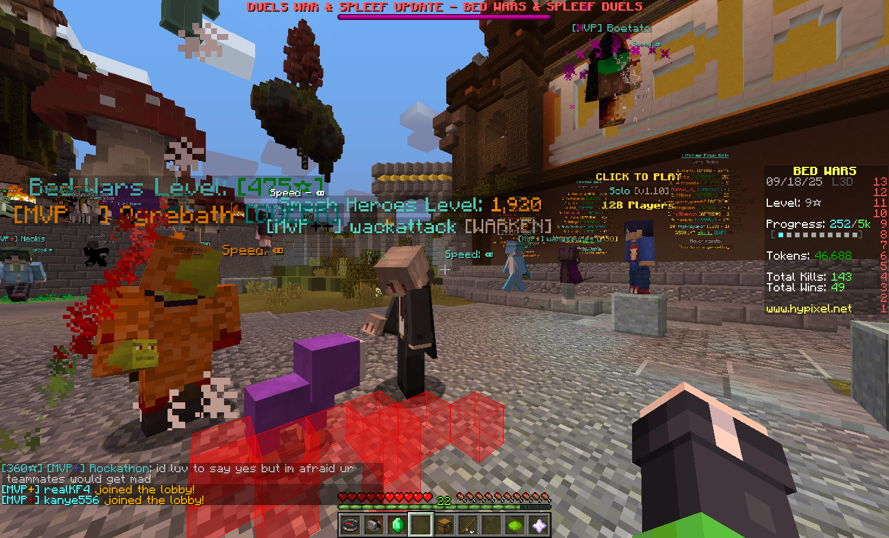

# Effect Bar

显示周围玩家的效果状态条

## Feature

- 可选 自己的是否显示
- 可选 隐身/蹲下时是否显示
- 可选 是否永远面向玩家
- 可选 是否渲染文本阴影
- 可选 是否根据玩家所在队伍渲染对应颜色的文本
- 可选 文本横向/纵向显示/
- 自定义文本 对齐模式/间距
- 渲染距离/偏移/尺寸可调整

## Command

### `/eveffectbar <option>`

- `toggle` — 切换开关
- `self` — 是否显示自己的
- `invis` — 隐身是否隐藏
- `sneak` — 蹲下是否隐藏
- `face` — 是否永远面向玩家
- `team` — 是否根据玩家队伍渲染文本颜色
- `shadow` — 是否渲染文本阴影
- `vertical` — 是否纵向显示文本
- `align` — 切换对齐方式
- `spacing <value>` — 文字渲染间距
- `distance <value>` — 最大渲染距离
- `scale <value>` — 渲染尺寸
- `xoffset <value>` / `yoffset <value>` / `zoffset <value>` — 渲染位置偏移

## Configuration

### `effectbar`

- `enabled`, `showSelf`, `hideWhenInvisible`, `hideWhenSneaking`, `facePlayer`, `teamColor`, `textShadow`, `vertical` — booleans
- `maxDistance`, `scale`, `xOffset`, `yOffset`, `zOffset` — floats
- `textAlgin`, `textSpacing` — ints