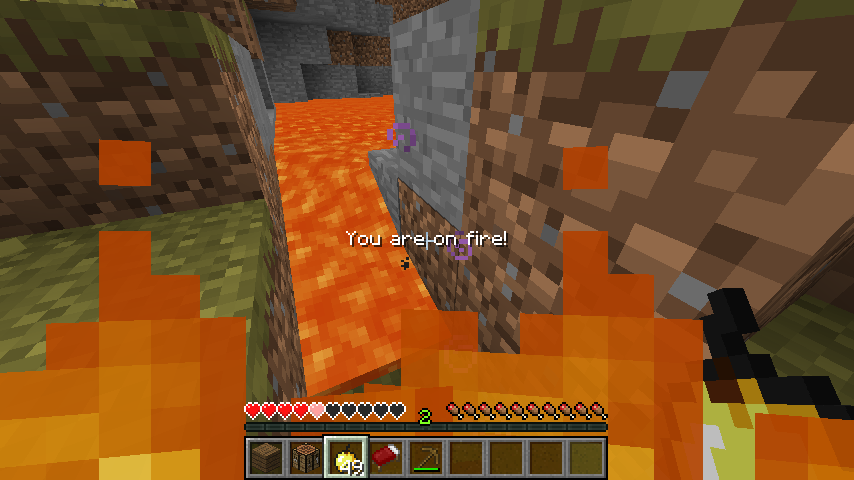

# Fire HUD

在屏幕显示当前玩家着火状态

## Feature

- 可选 是否在打开 GUI 时隐藏
- 可选 拥有抗火时是否显示
- 自定义文本内容/颜色/阴影
- 渲染尺寸/偏移 可调整

## Command

### `/evfirehud <option>`

- `toggle` — 切换开关
- `gui` — 是否在打开 GUI 时隐藏
- `effect` — 拥有抗火时是否隐藏
- `text <value>` — 设置渲染文本 (包含连续多个空格则需要到配置文件修改)
- `color <value>` — 文本颜色 (16进制 ARGB 字符串)
- `shadow` — 是否渲染文本阴影
- `scale <value>` — 渲染尺寸
- `xoffset <value>` / `yoffset <value>` — 渲染位置偏移

## Configuration

### `firehud`

- `enabled`, `hideWhenGuiOpen`, `hideWhenEffect`, `shadow` — booleans
- `scale`, `xoffset`, `yoffset` — floats
- `text`, `color` — Strings