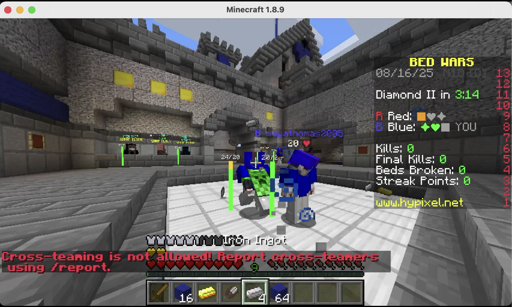

# Health Bar

显示周围玩家的血量条，支持金苹果的伤害吸收值

## Feature

- 可选 自己的是否显示
- 可选 隐身/蹲下时是否显示
- 可选 是否渲染血条/血量文本
- 可选 是否永远面向玩家
- 可选 是否按独立颜色渲染伤害吸收值
- 可选 是否渲染文本阴影
- 渲染距离/偏移/尺寸 及 血条的尺寸/旋转/偏移 可调整
- 根据血量的由高到低，血条有动态的颜色显示 **绿 → 黄 → 红**
- 根据玩家所在队伍渲染对应颜色的血量文本
- 文本颜色/伤害吸收值文本颜色 可调整

## Command

### `/evhealthbar <option>`

- `toggle` — 切换开关
- `self` — 是否显示自己的
- `invis` — 隐身是否隐藏
- `sneak` — 蹲下是否隐藏
- `bar` — 是否渲染血条
- `text` — 是否渲染文本
- `face` — 是否永远面向玩家
- `team` — 是否根据玩家队伍渲染文本颜色
- `absorb` — 是否按独立颜色渲染伤害吸收值
- `shadow` — 是否渲染文本阴影
- `distance <value>` — 最大渲染距离
- `scale <value>` — 渲染尺寸
- `xoffset <value>` / `yoffset <value>` / `zoffset <value>` — 渲染位置偏移
- `barwidth <value>` — 设置血条宽度
- `barheight <value>` — 设置血条长度
- `barrotation <value>` — 设置血条旋转（当然，只是在固定平面的旋转）
- `barxoffset <value>` / `baryoffset <value>` / `barzoffset <value>` — 血条位置偏移
- `color <value>` / `absorbcolor <value>` — 设置文本/伤害吸收文本颜色 

## Configuration

### `healthbar`

- `enabled`, `showSelf`, `hideWhenInvisible`, `hideWhenSneaking`, `renderBar`, `renderText`, `facePlayer`, `teamColor`, `absorbColor`, `textShadow` — booleans
- `maxDistance`, `scale`, `xOffset`, `yOffset`, `zOffset`, `barWidth`, `barHeight`, `barRotation`, `barXOffset`, `barYOffset`, `barZOffset` — floats
- `textColor`, `absorbTextColor` — Strings
