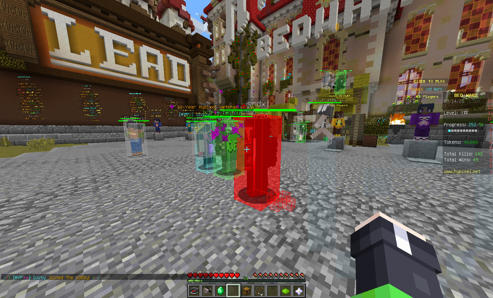

# Hit Box

显示周围玩家的碰撞箱

## Feature

- 可选 是否忽略实体光照渲染影响
- 可选 自己的是否显示
- 可选 隐身/蹲下时是否显示
- 可选 是否按真实检测尺寸渲染
- 可选 是否渲染边/面
- 可选 是否重新染色鼠标指向玩家的碰撞箱
- 可选 是否根据玩家所在队伍决定渲染颜色
- 渲染距离及边宽度 可调整
- 上述边/面颜色 均可单独调整, 对于队伍颜色支持调整透明度

## Command

### `/evhitbox <option>`

- `toggle` — 切换开关
- `lightmap` — 是否忽略实体光照
- `self` — 是否显示自己的
- `invis` — 隐身是否隐藏
- `sneak` — 蹲下是否隐藏
- `real` — 是否按真实检测尺寸渲染
- `edge` — 是否渲染碰撞箱边
- `face` — 是否渲染碰撞箱面
- `aimedge` — 是否重新染色鼠标指向玩家的碰撞箱边
- `aimface` — 是否重新染色鼠标指向玩家的碰撞箱面
- `teamedge` — 是否根据玩家所在队伍决定边渲染颜色
- `teamface` — 是否根据玩家所在队伍决定面渲染颜色
- `distance <value>` — 渲染距离
- `width <value>` — 边宽度
- `edgecolor <value>` — 边颜色 (16进制 ARGB 字符串)
- `facecolor <value>` — 面颜色 (16进制 ARGB 字符串)
- `edgecolor <value>` — 指向时重染的边颜色 (16进制 ARGB 字符串)
- `facecolor <value>` — 指向时重染的面颜色 (16进制 ARGB 字符串)
- `edgecolor <value>` — 队伍颜色边透明度 (16进制 alpha 字符串)
- `facecolor <value>` — 队伍颜色面透明度 (16进制 alpha 字符串)

## Configuration

### `hitbox`

- `enabled`, `ignoreLightmap`, `showSelf`, `hideWhenInvisible`, `hideWhenSneaking`, `renderRealSize`, `renderEdges`, `renderFaces`, `recolorEdgeWhenAim`, `recolorFaceWhenAim`, `teamEdgeColor`, `teamFaceColor`  — booleans
- `maxDistance`, `edgeWidth` — floats
- `edgeColor`, `faceColor`, `aimEdgeColor`, `aimFaceColor`, `teamEdgeAlpha`, `teamFaceAlpha` — Strings