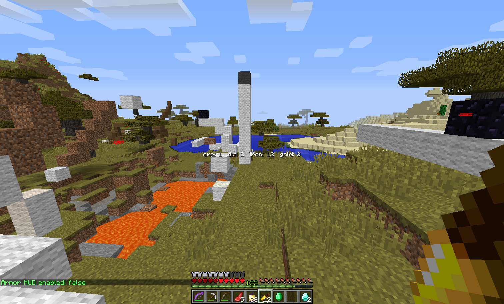

# Item Counter

简单的背包物品计量器

## Feature

- 可选 是否在打开 GUI 时隐藏
- 文本 颜色/阴影/对齐模式/间距 可调整
- 可选 横向/纵向显示
- 渲染尺寸/偏移 可调整
- 不同物品应用不同颜色

## Command

### `/evitemcounter <option>`

- `toggle` — 切换开关
- `gui` — 是否在打开 GUI 时隐藏
- `color <value>` — 文本颜色 (16进制 ARGB 字符串)
- `shadow` — 是否渲染文本阴影
- `vertical` — 是否纵向显示
- `align` — 切换对齐方式
- `spacing <value>` — 文字渲染间距
- `scale <value>` — 渲染尺寸
- `xoffset <value>` / `yoffset <value>` — 渲染位置偏移
- `add <value>` / `remove <value>` — 添加/移除需计量物品

## Configuration

### `itemcounter`

- `enabled`, `hideWhenGuiOpen`, `shadow`, `vertical` — booleans
- `scale`, `xoffset`, `yoffset` — floats
- `color` — String
- `itemList`, `colorList` — String Lists
- `textAlgin`, `textSpacing` — ints